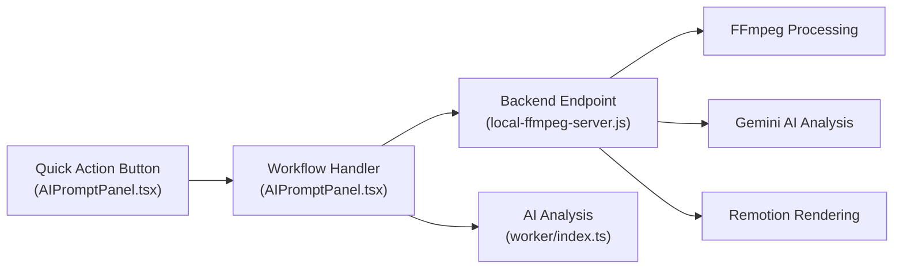

# Todo
- #1: Add backend FFmpeg processing and R2 file storage
- #2: Connect UI to backend video processing for actual video editing

# New Features Implementation Plan

Add 6 new AI-powered features to HyperEdit, all accessible from the **Director tab → Quick Actions** submenu in [AIPromptPanel.tsx](file:///c:/Users/Ashley/.gemini/antigravity/scratch/new-hyperedit/src/react-app/components/AIPromptPanel.tsx).

## User Review Required

> [!IMPORTANT]
> **External API Dependencies**: Features 2 (Copy Video) and 5a (AI Voiceover) require OpenAI API calls. Feature 5c (Audio De-Noising) can use FFmpeg filters for a basic version, but a higher-quality version would need an external AI audio model. The `OPENAI_API_KEY` already exists in [.dev.vars](file:///c:/Users/Ashley/.gemini/antigravity/scratch/new-hyperedit/.dev.vars) — confirm it should be used for TTS voiceover.

> [!WARNING]
> **FFmpeg Server Size**: The server is already ~7,700 lines. Each feature adds 150-400 lines. Consider whether you'd like us to split it into separate files/modules as part of this work or keep everything in the single file for now.

> [!IMPORTANT]
> **Phased Delivery**: These 6 features are substantial. We recommend implementing them in 3 phases (see bottom). Please confirm the priority order.

---

## Current Architecture (Summary)

The app follows a 3-layer pattern for each feature:



**For each new feature, we touch these files:**

| File | Role |
|------|------|
| [AIPromptPanel.tsx](file:///c:/Users/Ashley/.gemini/antigravity/scratch/new-hyperedit/src/react-app/components/AIPromptPanel.tsx) | Add to `suggestions[]`, [WorkflowType](file:///c:/Users/Ashley/.gemini/antigravity/scratch/new-hyperedit/src/react-app/components/AIPromptPanel.tsx#880-895), [determineWorkflow()](file:///c:/Users/Ashley/.gemini/antigravity/scratch/new-hyperedit/src/react-app/components/AIPromptPanel.tsx#911-1099), new `handleXxxWorkflow()` |
| [Home.tsx](file:///c:/Users/Ashley/.gemini/antigravity/scratch/new-hyperedit/src/react-app/pages/Home.tsx) | Wire new callback props from `useProject` to [AIPromptPanel](file:///c:/Users/Ashley/.gemini/antigravity/scratch/new-hyperedit/src/react-app/components/AIPromptPanel.tsx#200-2994) |
| [useProject.ts](file:///c:/Users/Ashley/.gemini/antigravity/scratch/new-hyperedit/src/react-app/hooks/useProject.ts) | (If needed) Add new state/actions for timeline manipulation |
| [local-ffmpeg-server.js](file:///c:/Users/Ashley/.gemini/antigravity/scratch/new-hyperedit/scripts/local-ffmpeg-server.js) | Add endpoint handlers + route registrations |
| [AIPromptPanelProps](file:///c:/Users/Ashley/.gemini/antigravity/scratch/new-hyperedit/src/react-app/components/AIPromptPanel.tsx#L166-L198) | Add new callback prop types |

---

## Proposed Changes

### Feature 1: Auto-Edit ("Smart Storyboarder")

**Goal**: Turn raw footage clips into a 1-2 minute social media-ready video automatically.

---

#### [MODIFY] [local-ffmpeg-server.js](file:///c:/Users/Ashley/.gemini/antigravity/scratch/new-hyperedit/scripts/local-ffmpeg-server.js)

**New endpoint: `POST /session/{id}/auto-edit`**

1. **Gather asset metadata**: List all video assets in the session, read filenames (which contain timestamps), get durations via `ffprobe`.
2. **Extract preview frames**: For each long clip (>30s), use FFmpeg to extract 1 frame every 10 seconds to a temp folder: `ffmpeg -i clip.mp4 -vf "fps=1/10" -q:v 5 frame_%03d.jpg`
3. **Gemini analysis**: Send the timestamped filenames, durations, and frame descriptions to Gemini with a structured prompt:
   - *"You have these clips from a worktop restoration. Identify phases (Before, Sanding, Oiling, After). Select 3-5s of best action from each. For long clips (>60s), recommend timelapse speed. Return JSON edit list."*
4. **Output an Edit JSON**: Return `{ editList: [{ assetId, start, duration, speed?, label }], totalDuration, phases: string[] }`
5. **Apply to timeline**: The frontend reads the JSON and maps each entry to a `TimelineClip` on V1, using `start`/`duration` as in/out points with `speed` for timelapses.

**Request body**: `{ targetDuration?: number }` (default: 60-120 seconds)

**Response**: `{ editList: EditListItem[], totalDuration: number }`

#### [MODIFY] [AIPromptPanel.tsx](file:///c:/Users/Ashley/.gemini/antigravity/scratch/new-hyperedit/src/react-app/components/AIPromptPanel.tsx)

- Add `'auto-edit'` to [WorkflowType](file:///c:/Users/Ashley/.gemini/antigravity/scratch/new-hyperedit/src/react-app/components/AIPromptPanel.tsx#880-895) union (line ~880)
- Add keyword matching in [determineWorkflow()](file:///c:/Users/Ashley/.gemini/antigravity/scratch/new-hyperedit/src/react-app/components/AIPromptPanel.tsx#911-1099) for prompts like "auto edit", "smart edit", "storyboard", "create from clips"
- Add `handleAutoEditWorkflow()` handler:
  1. POST to `/session/{id}/auto-edit`
  2. Receive edit list JSON
  3. Show a preview/summary in chat: "Found 4 phases: Before (5s), Sanding (10s timelapse), Oiling (8s), Reveal (5s). Total: 28s"
  4. On approval, call `onAutoEdit(editList)` callback to place clips on timeline
- Add to `suggestions[]` array: `{ icon: Sparkles, text: 'Auto-edit from clips' }`

#### [MODIFY] [Home.tsx](file:///c:/Users/Ashley/.gemini/antigravity/scratch/new-hyperedit/src/react-app/pages/Home.tsx)

- Add `handleAutoEdit` callback that maps the edit list to `addClip()` calls on V1 track
- Wire as `onAutoEdit` prop to [AIPromptPanel](file:///c:/Users/Ashley/.gemini/antigravity/scratch/new-hyperedit/src/react-app/components/AIPromptPanel.tsx#200-2994)

---

### Feature 2: Copy Video ("Style & Pace Transfer")

**Goal**: Analyze a reference video and replicate its pacing/style on your clips.

---

#### [MODIFY] [local-ffmpeg-server.js](file:///c:/Users/Ashley/.gemini/antigravity/scratch/new-hyperedit/scripts/local-ffmpeg-server.js)

**New endpoint: `POST /session/{id}/analyze-reference`**

1. **Accept reference video**: Can use an asset already uploaded to the session, identified by `assetId`.
2. **Scene detection**: Use FFmpeg's `scdet` filter to detect cuts: `ffmpeg -i ref.mp4 -filter:v "scdet=t=10" -f null -` — parse the output for scene change timestamps.
3. **Compute pace metadata**:
   - Average cut length (total duration / number of cuts)
   - Cut length distribution (array of durations between cuts)
   - Overall pacing category: "fast" (<2s), "medium" (2-4s), "slow" (>4s)
4. **Audio BPM detection** (optional): Use FFmpeg `ebur128` filter or a lightweight beat detection approach. Can also send a short audio clip to Gemini and ask it to estimate BPM.
5. **Return pace metadata**: `{ avgCutLength, cutLengths[], pacing, bpm?, totalCuts, transitions[] }`

**New endpoint: `POST /session/{id}/apply-pace`**

1. Takes `{ paceMetadata, targetDuration? }` alongside session assets
2. Uses the pace metadata to constrain the auto-edit algorithm (reuses logic from Feature 1)
3. Trims clips to match `avgCutLength` from reference
4. Returns same `editList` format as auto-edit

#### [MODIFY] [AIPromptPanel.tsx](file:///c:/Users/Ashley/.gemini/antigravity/scratch/new-hyperedit/src/react-app/components/AIPromptPanel.tsx)

- Add `'copy-video'` to [WorkflowType](file:///c:/Users/Ashley/.gemini/antigravity/scratch/new-hyperedit/src/react-app/components/AIPromptPanel.tsx#880-895)
- Add keyword matching: "copy video", "match style", "pace transfer", "replicate edit"
- Add `handleCopyVideoWorkflow()`:
  1. Prompt user to select an asset as the reference video (use the existing reference picker or a dedicated selector)
  2. POST to `/session/{id}/analyze-reference` with the reference `assetId`
  3. Show pace summary: "Reference style: Fast-paced (1.5s avg cuts, 120 BPM). Apply to your clips?"
  4. On approval, POST to `/session/{id}/apply-pace` with pace metadata
  5. Map result edit list to timeline
- Add to `suggestions[]`: `{ icon: Copy, text: 'Copy video style' }` (import `Copy` from lucide-react)

#### [MODIFY] [Home.tsx](file:///c:/Users/Ashley/.gemini/antigravity/scratch/new-hyperedit/src/react-app/pages/Home.tsx)

- Add `handleCopyVideoEdit` callback (similar pattern to `handleAutoEdit`)
- Wire as `onCopyVideoEdit` prop

---

### Feature 3: Intelligent Timelapse

**Goal**: Create variable-speed timelapses of long clips, speeding up boring parts and slowing visually interesting parts.

---

#### [MODIFY] [local-ffmpeg-server.js](file:///c:/Users/Ashley/.gemini/antigravity/scratch/new-hyperedit/scripts/local-ffmpeg-server.js)

**New endpoint: `POST /session/{id}/create-timelapse`**

1. **Input**: `{ assetId, targetDuration?, uniformSpeed? }`
2. **Activity analysis**: Extract frames every 5 seconds. Use Gemini Vision to classify each segment as "low activity" (repetitive sanding) vs "high activity" (transitioning, applying oil, visible change).
3. **Speed mapping**: Assign speeds:
   - Low activity: 30x-50x
   - Medium activity: 10x-20x
   - High activity: 5x-10x
   - Key moments (first oil application etc.): 1x-2x (near real-time)
4. **Segmented processing**: Split asset into segments at activity boundaries using FFmpeg `-ss`/`-t`, apply `setpts` filter with the appropriate speed to each segment, then concat.
5. **Output**: Replace-in-place or create new asset. Return `{ assetId, duration, segments: [{ start, end, speed, label }] }`

**Alternative (simpler first pass)**: Accept a uniform speed multiplier and just use `ffmpeg -i input.mp4 -filter:v "setpts=PTS/{speed}" -an output.mp4` for basic timelapse without AI analysis.

#### [MODIFY] [AIPromptPanel.tsx](file:///c:/Users/Ashley/.gemini/antigravity/scratch/new-hyperedit/src/react-app/components/AIPromptPanel.tsx)

- Add `'timelapse'` to [WorkflowType](file:///c:/Users/Ashley/.gemini/antigravity/scratch/new-hyperedit/src/react-app/components/AIPromptPanel.tsx#880-895)
- Add keyword matching: "timelapse", "time lapse", "speed up long", "fast forward"
- Add `handleTimelapseWorkflow()`:
  1. If no specific clip referenced, offer selection — or default to longest clip
  2. Ask "Intelligent (AI detects activity) or uniform speed?"
  3. POST to `/session/{id}/create-timelapse`
  4. Show segments summary: "Created 45s timelapse: Sanding (30x), Oil application (5x), Drying (50x)"
  5. Update timeline clip with new duration
- Add to `suggestions[]`: `{ icon: Timer, text: 'Create timelapse' }` (Timer already imported)

#### [MODIFY] [Home.tsx](file:///c:/Users/Ashley/.gemini/antigravity/scratch/new-hyperedit/src/react-app/pages/Home.tsx)

- Add `handleCreateTimelapse` callback — calls server, refreshes assets, updates clip duration
- Wire as `onCreateTimelapse` prop

---

### Feature 4: Create Ad (Motion Graphics Integration)

**Goal**: Generate a 15-30s ad/TikTok with text overlays, split-screens, and CTAs from existing footage.

---

#### [MODIFY] [local-ffmpeg-server.js](file:///c:/Users/Ashley/.gemini/antigravity/scratch/new-hyperedit/scripts/local-ffmpeg-server.js)

**New endpoint: `POST /session/{id}/create-ad`**

1. **Input**: `{ format: '15s' | '30s' | '60s', platform: 'tiktok' | 'instagram' | 'youtube', style?: string }`
2. **Content analysis**: Use existing [getOrTranscribeVideo()](file:///c:/Users/Ashley/.gemini/antigravity/scratch/new-hyperedit/scripts/local-ffmpeg-server.js#2734-2848) + Gemini to identify:
   - "Hook" moment (most dramatic before/after contrast)
   - Key process phases
   - "Reveal" moment (finished result)
3. **Ad structure generation**: Ask Gemini to generate a Remotion scene structure:
   - Hook clip (grab attention in first 3 seconds)
   - Process montage (quick cuts/timelapses)
   - Text overlays ("Gross to Great", "Professional Restoration")
   - Before/After split-screen
   - CTA ("Follow for more", "Link in Bio")
4. **Render via Remotion**: Use existing [handleGenerateAnimation](file:///c:/Users/Ashley/.gemini/antigravity/scratch/new-hyperedit/scripts/local-ffmpeg-server.js#3669-4367) pattern — Gemini produces the DynamicAnimation scene JSON, Remotion renders it with the user's actual video clips embedded.
5. **Output**: New asset with the rendered ad video

This heavily reuses the existing **DynamicAnimation** + **Remotion rendering** pipeline.

#### [MODIFY] [AIPromptPanel.tsx](file:///c:/Users/Ashley/.gemini/antigravity/scratch/new-hyperedit/src/react-app/components/AIPromptPanel.tsx)

- Add `'create-ad'` to [WorkflowType](file:///c:/Users/Ashley/.gemini/antigravity/scratch/new-hyperedit/src/react-app/components/AIPromptPanel.tsx#880-895)
- Add keyword matching: "create ad", "tiktok ad", "promotional", "social media ad", "create promo"
- Add `handleCreateAdWorkflow()`:
  1. Ask for platform/duration preference (use clarification options UI)
  2. POST to `/session/{id}/create-ad`
  3. Show ad structure for approval (reuse animation concept approval pattern)
  4. Render and add to timeline on approval
- Add to `suggestions[]`: `{ icon: Zap, text: 'Create social ad' }` (or a new icon like `Megaphone`)

#### [MODIFY] [Home.tsx](file:///c:/Users/Ashley/.gemini/antigravity/scratch/new-hyperedit/src/react-app/pages/Home.tsx)

- Wire `onCreateAd` callback (follows same pattern as `onCreateCustomAnimation`)

---

### Feature 5: AI Extras (Voiceover, Satisfaction Detection, Audio Cleanup)

These are 3 smaller features grouped together.

---

#### 5a. AI Voiceover (TTS)

##### [MODIFY] [local-ffmpeg-server.js](file:///c:/Users/Ashley/.gemini/antigravity/scratch/new-hyperedit/scripts/local-ffmpeg-server.js)

**New endpoint: `POST /session/{id}/generate-voiceover`**

1. **Input**: `{ script?: string, autoGenerate?: boolean, voice?: string }`
2. **Script generation**: If `autoGenerate`, use existing transcription + Gemini to write a narration script based on the video phases (e.g. "Now we move to 240 grit for that buttery smooth finish")
3. **TTS synthesis**: Call OpenAI `audio/speech` API (model: `tts-1`, voice: `alloy`/`nova`/etc.) — the `OPENAI_API_KEY` is already in [.dev.vars](file:///c:/Users/Ashley/.gemini/antigravity/scratch/new-hyperedit/.dev.vars)
4. **Save as audio asset**: Write the MP3 to the session, register as new audio asset
5. **Output**: `{ assetId, filename, duration }` — frontend places on A2 track

##### [MODIFY] [AIPromptPanel.tsx](file:///c:/Users/Ashley/.gemini/antigravity/scratch/new-hyperedit/src/react-app/components/AIPromptPanel.tsx)

- Add `'voiceover'` to [WorkflowType](file:///c:/Users/Ashley/.gemini/antigravity/scratch/new-hyperedit/src/react-app/components/AIPromptPanel.tsx#880-895)
- Keyword matching: "voiceover", "narration", "voice over", "text to speech", "tts", "add narration"
- `handleVoiceoverWorkflow()`: Ask for custom script or auto-generate, show script for approval, POST, add audio to A2

#### 5b. Satisfaction Detection (Oil Reveal Slowdown)

##### [MODIFY] [local-ffmpeg-server.js](file:///c:/Users/Ashley/.gemini/antigravity/scratch/new-hyperedit/scripts/local-ffmpeg-server.js)

**New endpoint: `POST /session/{id}/detect-satisfaction-moments`**

1. **Input**: `{ assetId }`
2. **Frame analysis**: Extract frames every 2 seconds, send to Gemini Vision: *"Identify the exact moments where oil is applied to wood and the color dramatically changes. Return timestamps."*
3. **Output**: `{ moments: [{ timestamp, description, suggestedSpeed: 0.5 }] }`
4. **Apply**: Frontend can use existing asset processing to slow these sections with: `ffmpeg -i input.mp4 -filter:v "setpts=2.0*PTS" -filter:a "atempo=0.5" -ss {start} -t {duration} output.mp4`

This integrates into the **Timelapse** feature (Feature 3) as an enhancement — satisfaction moments get automatic slow-mo.

#### 5c. Audio De-noising / Cleanup

##### [MODIFY] [local-ffmpeg-server.js](file:///c:/Users/Ashley/.gemini/antigravity/scratch/new-hyperedit/scripts/local-ffmpeg-server.js)

**New endpoint: `POST /session/{id}/clean-audio`**

1. **Input**: `{ assetId, mode: 'denoise' | 'remove-tools' | 'asmr' }`
2. **Processing**: Use FFmpeg audio filters:
   - `denoise`: `afftdn=nf=-25` (already exists as an FFmpeg command suggestion)
   - `remove-tools`: `highpass=f=300,lowpass=f=4000,afftdn=nf=-30` (aggressive tool noise removal)
   - `asmr`: `highpass=f=100,lowpass=f=8000,afftdn=nf=-15,equalizer=f=2000:width_type=o:width=2:g=3` (keep wood scratching, remove motor noise)
3. **Replace in-place**: Same pattern as existing [handleProcessAsset](file:///c:/Users/Ashley/.gemini/antigravity/scratch/new-hyperedit/scripts/local-ffmpeg-server.js#7357-7490)
4. **Output**: `{ assetId, mode }`

##### [MODIFY] [AIPromptPanel.tsx](file:///c:/Users/Ashley/.gemini/antigravity/scratch/new-hyperedit/src/react-app/components/AIPromptPanel.tsx)

- Add `'clean-audio'` to [WorkflowType](file:///c:/Users/Ashley/.gemini/antigravity/scratch/new-hyperedit/src/react-app/components/AIPromptPanel.tsx#880-895)
- Keyword matching: "clean audio", "denoise", "remove noise", "asmr audio", "audio cleanup"
- `handleCleanAudioWorkflow()`: Use clarification UI for mode selection
- Add to `suggestions[]`: `{ icon: Volume2, text: 'Clean audio (ASMR)' }`

---

### Feature 6: Auto Order

**Goal**: Automatically reorder timeline clips based on their filenames (date-time stamped).

---

#### [MODIFY] [AIPromptPanel.tsx](file:///c:/Users/Ashley/.gemini/antigravity/scratch/new-hyperedit/src/react-app/components/AIPromptPanel.tsx)

This feature is **frontend-only** — no backend endpoint needed.

- Add `'auto-order'` to [WorkflowType](file:///c:/Users/Ashley/.gemini/antigravity/scratch/new-hyperedit/src/react-app/components/AIPromptPanel.tsx#880-895)
- Keyword matching: "auto order", "reorder clips", "sort clips", "chronological order", "order by time"
- Add `handleAutoOrderWorkflow()`:
  1. Read all clips on V1 track
  2. For each clip, look up the asset filename
  3. Parse the date-time from filenames (e.g. `2024-01-15_14-30-00.mp4` or similar timestamped formats)
  4. Sort clips chronologically
  5. Reassign `startTime` values sequentially (clip₁.startTime = 0, clip₂.startTime = clip₁.duration, ...)
  6. Show reorder summary in chat: "Reordered 8 clips chronologically: clip1 → clip4 → clip2 → ..."
- Add to `suggestions[]`: `{ icon: ListOrdered, text: 'Auto-order clips' }` (ListOrdered already imported in Home.tsx — add import in AIPromptPanel)

#### [MODIFY] [Home.tsx](file:///c:/Users/Ashley/.gemini/antigravity/scratch/new-hyperedit/src/react-app/pages/Home.tsx)

- Add `handleAutoOrder` callback:
  1. Get V1 clips + their asset filenames
  2. Parse timestamps from filenames using regex patterns (support common formats: `YYYY-MM-DD_HH-MM-SS`, `YYYYMMDD_HHMMSS`, `IMG_YYYYMMDD`, etc.)
  3. Sort and reassign start times
  4. Call `updateClips()` or equivalent to update timeline state
- Wire as `onAutoOrder` prop

---

## Summary: All UI Changes to Quick Actions

New entries for the `suggestions[]` array in [AIPromptPanel.tsx](file:///c:/Users/Ashley/.gemini/antigravity/scratch/new-hyperedit/src/react-app/components/AIPromptPanel.tsx):

```typescript
const suggestions = [
  // ... existing 12 items ...
  { icon: Wand2, text: 'Auto-edit from clips' },     // Feature 1
  { icon: Copy, text: 'Copy video style' },           // Feature 2
  { icon: Timer, text: 'Create timelapse' },          // Feature 3
  { icon: Megaphone, text: 'Create social ad' },      // Feature 4
  { icon: Mic, text: 'Add AI voiceover' },            // Feature 5a
  { icon: Volume2, text: 'Clean audio (ASMR)' },      // Feature 5c
  { icon: ListOrdered, text: 'Auto-order clips' },    // Feature 6
];
```

New [WorkflowType](file:///c:/Users/Ashley/.gemini/antigravity/scratch/new-hyperedit/src/react-app/components/AIPromptPanel.tsx#880-895) entries:
```typescript
type WorkflowType =
  // ... existing types ...
  | 'auto-edit'           // Feature 1
  | 'copy-video'          // Feature 2
  | 'timelapse'           // Feature 3
  | 'create-ad'           // Feature 4
  | 'voiceover'           // Feature 5a
  | 'clean-audio'         // Feature 5c
  | 'auto-order';         // Feature 6
```

> [!NOTE]
> Feature 5b (Satisfaction Detection) doesn't get its own Quick Action — it integrates into Feature 3 (Timelapse) as an automatic enhancement. When creating an intelligent timelapse, the system automatically detects and slow-mos satisfaction moments.

---

## New Dependencies

| Dependency | Purpose | Installation |
|-----------|---------|-------------|
| None for npm | All features use existing deps | — |
| OpenAI TTS API | Voiceover (Feature 5a) | Already configured via `OPENAI_API_KEY` in [.dev.vars](file:///c:/Users/Ashley/.gemini/antigravity/scratch/new-hyperedit/.dev.vars) |

No new npm packages are required. All features leverage existing tools:
- **FFmpeg** (already installed) for video processing, audio filtering, scene detection
- **Gemini API** (already configured) for content analysis and script generation
- **Remotion** (already configured) for motion graphics in Create Ad
- **OpenAI API** (already configured) for TTS voiceover

---

## Phased Implementation

### Phase 1 — Core Features (Recommended First)
1. **Feature 6: Auto Order** — Frontend-only, quick win, immediately useful
2. **Feature 3: Intelligent Timelapse** — High-value for the worktop use case
3. **Feature 5c: Audio Cleanup** — Simple FFmpeg filters, quick to implement

### Phase 2 — AI-Powered Features
4. **Feature 1: Auto-Edit** — Complex but high-value; builds foundation for Feature 2
5. **Feature 5a: AI Voiceover** — Leverages existing OpenAI integration

### Phase 3 — Advanced Features
6. **Feature 2: Copy Video** — Builds on Auto-Edit foundation
7. **Feature 4: Create Ad** — Most complex; needs Remotion + video compositing
8. **Feature 5b: Satisfaction Detection** — Enhancement to Timelapse

---

## Verification Plan

> [!NOTE]
> No test framework is currently configured in this project ([CLAUDE.md](file:///c:/Users/Ashley/.gemini/antigravity/scratch/new-hyperedit/CLAUDE.md) confirms: "No tests exist in the codebase. No testing framework is configured."). Verification will be manual via the browser and server logs.

### Manual Verification (Per Feature)

Each feature will be verified by:

1. **Start the dev servers**: Run `npm run dev` and `npm run ffmpeg-server` in separate terminals
2. **Upload test clips**: Upload 3-5 short video clips with timestamped filenames to the app
3. **Trigger via Quick Actions**: Click the new Quick Action button for each feature
4. **Verify chat flow**: Confirm the chat shows the expected prompts, previews, and approval steps
5. **Verify timeline result**: Confirm clips appear correctly on the timeline after approval
6. **Verify server logs**: Check the FFmpeg server console for expected processing output
7. **TypeScript build check**: Run `npm run build` to confirm no type errors

### Specific Feature Tests

- **Auto-Edit**: Upload 5+ clips → click "Auto-edit from clips" → verify edit list JSON → approve → check V1 timeline has clips in logical order with appropriate durations
- **Copy Video**: Upload a reference video + raw clips → click "Copy video style" → verify pace analysis numbers → approve → check clips match reference pacing
- **Timelapse**: Upload a long clip (>1 min) → click "Create timelapse" → select "Intelligent" → verify segment breakdown → check output duration is reduced
- **Create Ad**: Upload before/after clips → click "Create social ad" → select TikTok/15s → verify ad structure → approve render → check output has overlays
- **Voiceover**: Upload video → click "Add AI voiceover" → approve generated script → verify audio asset appears on A2 track
- **Audio Cleanup**: Upload video with tool noise → click "Clean audio" → select "ASMR" mode → verify audio is cleaned (compare before/after)
- **Auto Order**: Upload clips with timestamp filenames → click "Auto-order clips" → verify V1 clips are reordered chronologically
---

## Phase 4 — Recent Additions

### Feature 7: Merge All ("Sequence Baker") [DONE]

**Goal**: Concatenate all assets on the timeline into a single asset, preserving their current order.

#### Implementation Details:

- **Backend**: Added `POST /session/:id/merge-all` to [local-ffmpeg-server.js](file:///c:/Users/Ashley/.gemini/antigravity/scratch/new-hyperedit/scripts/local-ffmpeg-server.js). It uses FFmpeg to segment and then concatenate clips using the `concat` demuxer.
- **Frontend (UI)**: Added "Merge all clips" to Quick Actions in [AIPromptPanel.tsx](file:///c:/Users/Ashley/.gemini/antigravity/scratch/new-hyperedit/src/react-app/components/AIPromptPanel.tsx).
- **Frontend (Logic)**: Implemented `handleMergeAll` in [Home.tsx](file:///c:/Users/Ashley/.gemini/antigravity/scratch/new-hyperedit/src/react-app/pages/Home.tsx) to gather clips, call the backend, and replace the timeline with the new merged asset.

---

## Other Recent Improvements [DONE]

- **Undo / Redo**: Added working undo/redo buttons to the timeline toolbar.
- **Master Volume**: Added a volume slider to the timeline toolbar and implemented programmatic volume control in the video preview.
- **Auto-Resizing Player**: Media player now auto-resizes to fit the imported asset's aspect ratio (Portrait/Landscape) by default.
